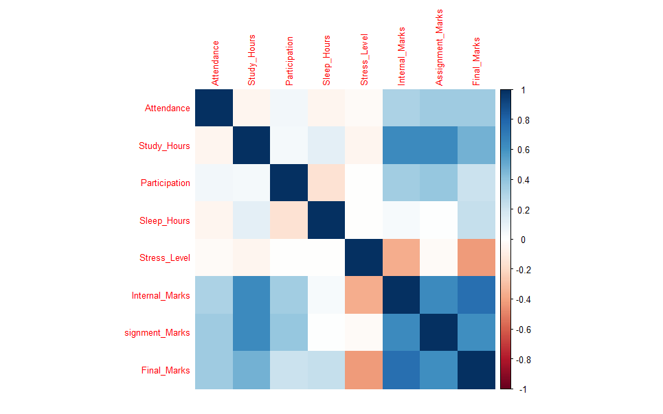
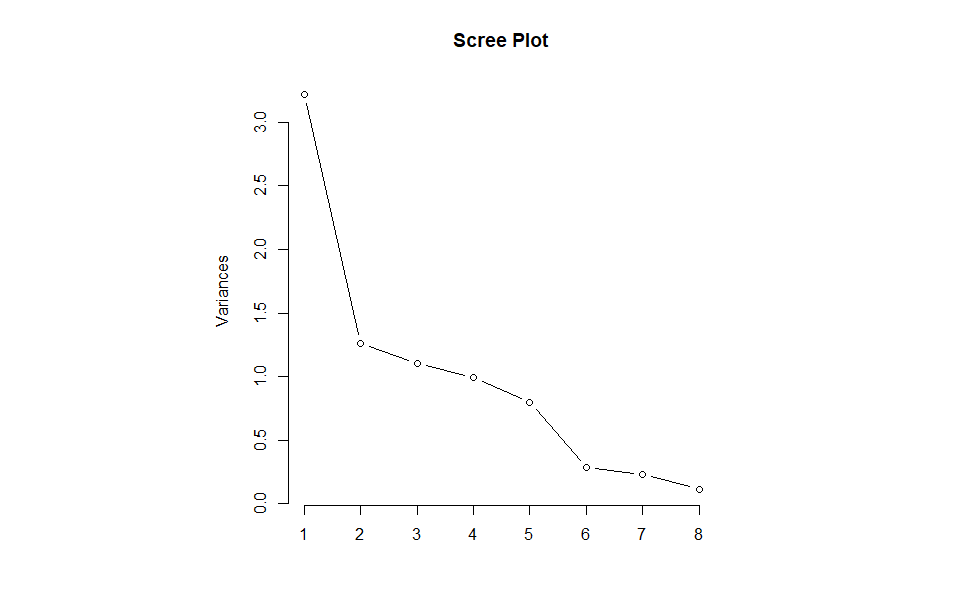
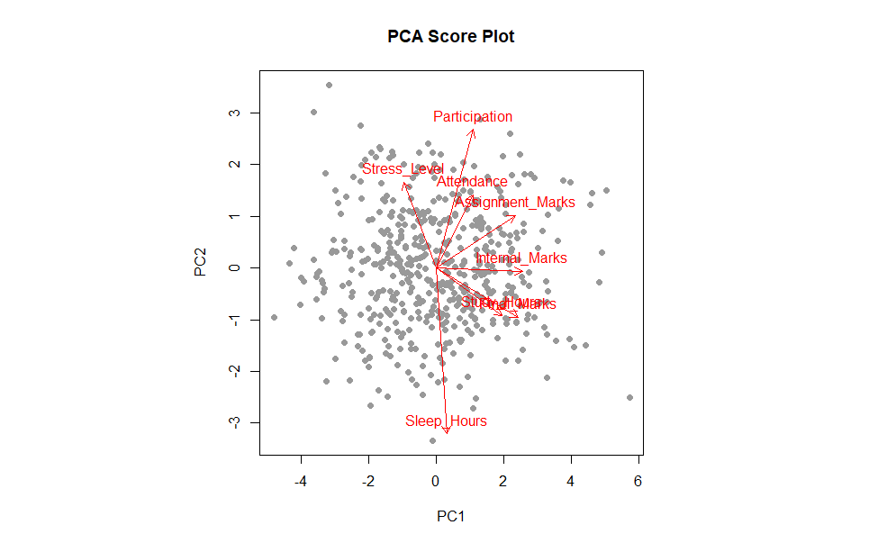
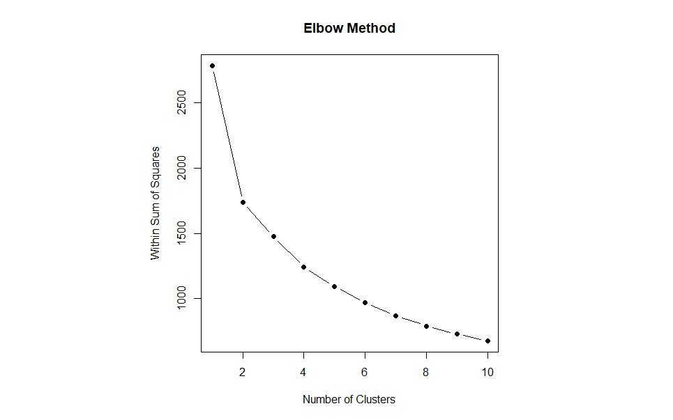
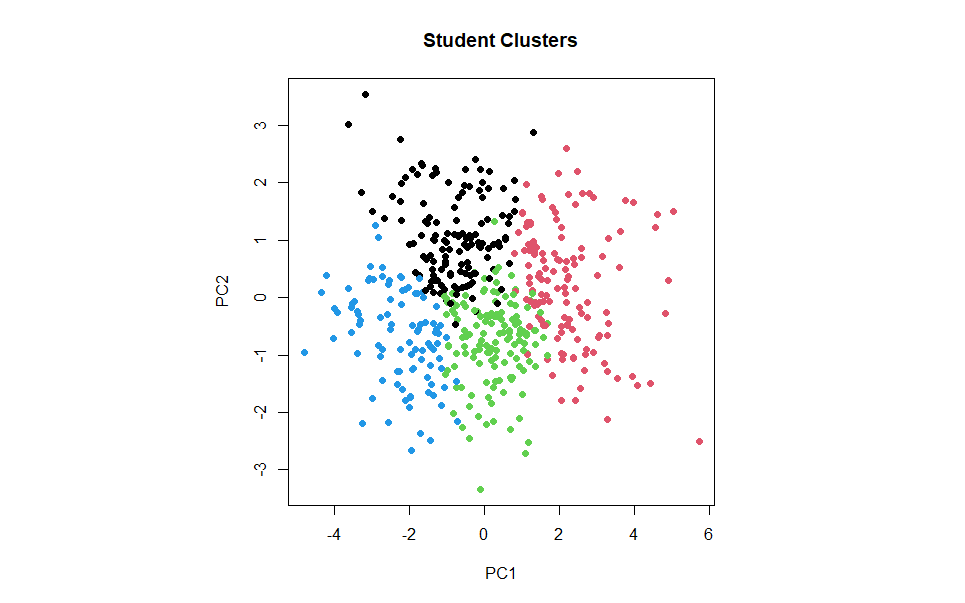

# Student Success Analytics in R  
### PCA, Segmentation, and Insights

## Project Overview

This project analyzes 500 student records using Principal Component Analysis (PCA) and K-Means Clustering in R to uncover hidden drivers of academic success and segment students into meaningful learner groups.

It demonstrates how analytics can support smarter educational interventions through data-driven insights.

---

## Objective

- Identify key factors influencing student performance  
- Reduce multiple variables into core dimensions using PCA  
- Segment students into actionable groups using clustering  
- Highlight at-risk and high-performing learners  

---

## Dataset

Synthetic dataset containing **500 student records** with the following variables:

- Attendance  
- Study Hours  
- Participation  
- Sleep Hours  
- Stress Level  
- Internal Marks  
- Assignment Marks  
- Final Marks  

---

## Tools Used

- R  
- Principal Component Analysis (PCA)  
- K-Means Clustering  
- ggplot2  
- corrplot  
- dplyr

---

## Methodology

1. Generated synthetic student dataset using realistic relationships  
2. Performed exploratory data analysis  
3. Applied PCA for dimensionality reduction  
4. Used Elbow Method to determine optimal clusters  
5. Segmented students using K-Means Clustering  
6. Interpreted cluster profiles and performance patterns  

---

## Key Findings

- Reduced 8 variables into core performance dimensions  
- Identified 4 student segments  
- Highlighted at-risk and high-performing groups  
- Revealed relationships between attendance, stress, and academic outcomes  

---

## Visual Outputs

### Correlation Heatmap

### Scree Plot

### PCA Score Plot

### Elbow Method

### Student Clusters

---

## Files Included

- `student_success_analytics_final.R`
- `student_success_project.csv`
- `Student_Success_Report.pdf`
- `plots/`

---

## Business Value

This framework can help institutions:

- Detect at-risk students early  
- Improve retention rates  
- Personalize interventions  
- Support student wellness strategies  
- Build academic performance dashboards
